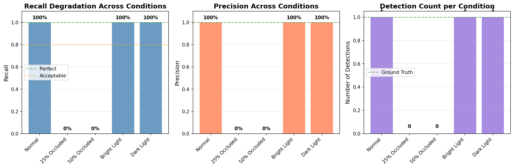

# RGB-D Person Detection: Dependability Analysis

Systematic evaluation of YOLOv8 person detection under industrial stress conditions using RGB-D sensor fusion.

## 🎯 Project Overview

This project investigates the **dependability** of state-of-the-art object detection algorithms (YOLOv8) for safety-critical applications like Automated Guided Vehicles (AGVs). Rather than just measuring average accuracy, we systematically analyze **performance degradation** under realistic failure modes: occlusion, lighting variations, and sensor noise.

## 🔬 Key Technical Contributions

### 1. 2D-to-3D Sensor Fusion
- Implemented **pinhole camera projection** to map 2D bounding boxes onto aligned depth maps
- Achieved precise 3D localization (X, Y, Z coordinates) of detected persons
- Added **depth consistency filtering** to reduce false positives

### 2. Systematic Degradation Testing
Generated synthetic RGB-D test data with controlled conditions:
- ✅ Normal baseline
- ⚠️ 25% occlusion
- ⚠️ 50% occlusion  
- ☀️ Bright lighting (+50%)
- 🌙 Dark lighting (-50%)

### 3. Proper Evaluation Metrics
- **IoU (Intersection over Union)** for detection quality
- **Recall** for safety-critical analysis (missed detections = dangerous)
- **Precision** for false positive analysis

## 📊 Key Findings

| Condition | Recall | Precision | Key Insight |
|-----------|--------|-----------|-------------|
| Normal | 100% | 100% | Baseline performance |
| 25% Occluded | **0%** | - | Complete failure |
| 50% Occluded | **0%** | - | Complete failure |
| Bright Light | 100% | 100% | Lighting robust |
| Dark Light | 100% | 100% | Lighting robust |

### Critical Insight
YOLOv8 is **robust to lighting changes** but **fails catastrophically under occlusion**. Even 25% occlusion caused complete detection failure. This demonstrates why **multi-view camera setups** are essential for AGV safety.

## 🛠️ Technical Stack

- **Detection**: YOLOv8 (Ultralytics)
- **3D Projection**: OpenCV + NumPy (Pinhole Camera Model)
- **Deep Learning**: PyTorch
- **Evaluation**: Custom IoU/Recall implementation
- **Visualization**: Matplotlib

## 📁 Project Structure
```
RGBD-Person-Detection/
├── src/
│   ├── detection.py       # YOLO person detection
│   ├── fusion_3d.py        # 2D-to-3D projection with depth
│   ├── evaluation.py       # IoU, Precision, Recall metrics
│   ├── synthetic_data.py   # Test data generation
│   └── analyze.py          # Complete pipeline
├── dataset/                # Synthetic RGB-D test data
├── outputs/                # Results and visualizations
└── requirements.txt
```

## 🚀 Usage
```bash
# Setup
pip install -r requirements.txt

# Generate synthetic test data
python src/synthetic_data.py

# Run complete analysis
python src/analyze.py
```

## 📈 Results

Performance degradation visualization:



## 🎓 Academic Motivation

This project was developed for research into **dependable AI for safety-critical applications**. Traditional object detection benchmarks focus on average accuracy across large datasets. However, for applications like AGVs in factories, we need to understand:

1. **When does the system fail?** (failure modes)
2. **How badly does it fail?** (degradation curves)
3. **Can we predict failures?** (depth consistency checks)

## 🔮 Future Work

- [ ] Test on real RGB-D datasets (TUM RGB-D, NYU Depth)
- [ ] Implement multi-view fusion for occlusion handling
- [ ] Add temporal tracking (Kalman filtering)
- [ ] Benchmark against 3D detection models (PointPillars, VoxelNet)

## 📝 Citation

Developed as part of research into dependable perception systems for autonomous vehicles.

---

**Author**: Ahemad Daniyal  
**Focus**: Computational Engineering with specialization in Robust AI Systems